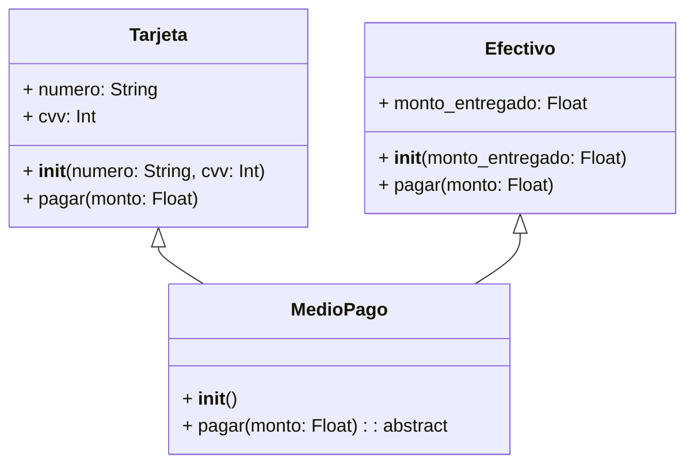
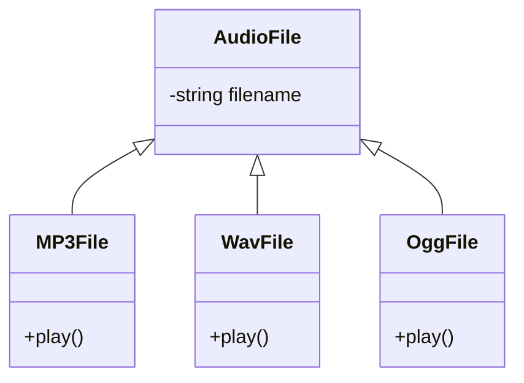
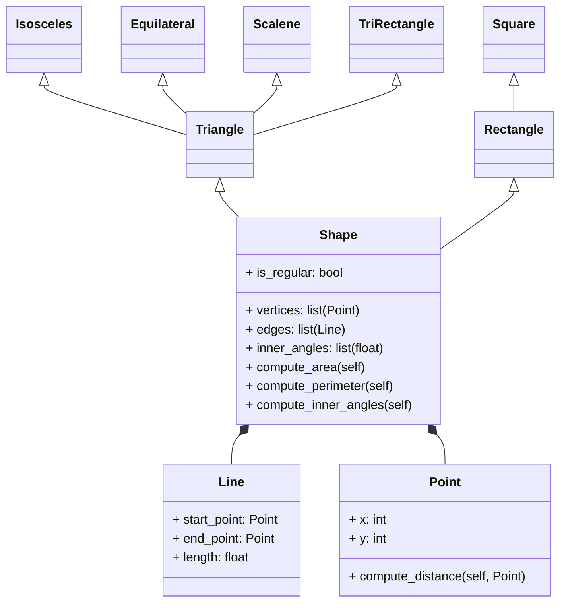

# Programación Orientada a Objetos - UNAL

## Clase 10: Poliformismo

### Qué es poliformismo?

El **polimorfismo** (literalmente significa "muchas formas") es un principio de la programación orientada a objetos (POO) que permite que objetos de diferentes clases sean tratados como objetos de una clase común. Esto significa *que diferentes clases pueden definir métodos con el mismo nombre pero con implementaciones distintas*. El poliformismo se logra principalmente gracias a al *herencia*.

**Utilidad**
 - **Extensibilidad:** Facilita la extensión del código al permitir *agregar nuevas funcionalidades* sin necesidad de modificar las clases existentes.
 - **Flexibilidad:** Al utilizar *interfaces* o clases base polimórficas, se puede cambiar la implementación concreta sin necesidad de alterar el código que utiliza estas abstracciones. Esto es crucial para mantener el código adaptable.


**Ejemplo:** Figuras geométricas:

 ```mermaid
classDiagram
class Figura {
  + __init__()
  + area(): abstract
}

class Cuadrado {
  + lado: Float
  + __init__(lado: Float)
  + area(): Float
}

class Circulo {
  + radio: Float
  + __init__(radio: Float)
  + area(): Float
}

Circulo <|-- Figura
Cuadrado <|-- Figura
```

```python
class Figura:
  def __init__(self):
    pass

  def area(self):
    # Solo para ser estrictos, también se podría poner un pass
    raise NotImplementedError("Subclases deben implementar area()")

class Cuadrado(Figura):
  def __init__(self, lado):
    super().__init__()
    self.lado = lado

  def area(self):
    return self.lado * self.lado

class Circulo(Figura):
  def __init__(self, radio):
    super().__init__()
    self.radio = radio

  def area(self):
    return 3.14 * self.radio * self.radio


figura1 = Cuadrado(5)
figura2 = Circulo(3)

print(f"El area del cuadrado es: {figura1.area()}")
print(f"El area del circulo es: {figura2.area()}")
```

En este ejemplo, la clase Figura es la clase base y define el método abstracto area(). Las clases Cuadrado y Circulo heredan de Figura e implementan su propio comportamiento para el método area(). Cuando llamamos al método area() en un objeto de cualquiera de las subclases, se ejecuta la implementación correspondiente a esa clase, mostrando el comportamiento polimórfico.

**Ejemplo:** Métodos de pago:



```python
class MedioPago:
  def __init__(self):
    pass

  def pagar(self, monto):
    raise NotImplementedError("Subclases deben implementar pagar()")

class Tarjeta(MedioPago):
  def __init__(self, numero, cvv):
    super().__init__()
    self.numero = numero
    self.cvv = cvv

  def pagar(self, monto):
    print(f"Pagando {monto} con tarjeta {self.numero[-4:]}")

class Efectivo(MedioPago):
  def __init__(self, monto_entregado):
    super().__init__()
    self.monto_entregado = monto_entregado

  def pagar(self, monto):
    if self.monto_entregado >= monto:
      print(f"Pago realizado en efectivo. Cambio: {self.monto_entregado - monto}")
    else:
      print(f"Fondos insuficientes. Faltan {monto - self.monto_entregado} para completar el pago.")

# Ejemplo de uso
pago1 = Tarjeta("1234567890123456", 123)
pago2 = Efectivo(100)

pago1.pagar(50)
pago2.pagar(75)
```

En este ejemplo, la clase MedioPago define el método abstracto pagar(). Las clases Tarjeta y Efectivo heredan de MedioPago e implementan su propio comportamiento para pagar(). Al llamar a pagar() en un objeto de cualquiera de las subclases, se ejecuta la implementación adecuada, mostrando nuevamente el polimorfismo.

### Duck-typing
El *"Duck Typing"* es un paradigma de programación que se basa en la idea de que un objeto "es" lo que "hace". En otras palabras, si un objeto tiene los métodos y atributos necesarios para realizar una tarea, no importa de qué clase sea o cómo se haya implementado.

Duck Typing en Python se refiere a la práctica de no verificar explícitamente el tipo de un objeto antes de invocar un método o propiedad existente en ese objeto. Si un objeto puede realizar la acción requerida, se puede utilizar independientemente de su clase (Si puede hacer quak es una pato, así sea una ganso).



```python
class AudioFile:
    def __init__(self, filename):
        self.filename = filename

class MP3File(AudioFile):
    def play(self):
        print(f"playing {self.filename} as mp3")

class WavFile(AudioFile):
    def play(self):
        print(f"playing {self.filename} as wav")

class OggFile(AudioFile):
    def play(self):
        print(f"playing {self.filename} as ogg")

def play_media(player):
    player.play()

mp3_player = MP3File()
ogg_player = OggFile()

play_media(mp3_player)  # Playing MP3
play_media(ogg_player)  # Playing OGG
```

**Ejercicio:**
1. Create a superclass called Shape(), which is the base of the classes Reactangle() and Square(), define the methods compute_area and compute_perimeter in Shape() and then using polymorphism redefine the methods properly in Rectangle and in Square.

2. Using the classes Point() and Line() define a new super-class Shape() with the following structure:



Use Inheritance, Composition, Encapsulation and Polymorphism to define the classes. All attributes must have their respective setters and getters.

## Reto 4: 
1. Include the class exercise in the repo.
2. **The restaurant revisted**
 - Add setters and getters to all subclasses for menu item
 - Override calculate_total_price() according to the order composition (e.g if the order includes a main course apply some disccount on beverages)
 - Add the class Payment() following the class example.

